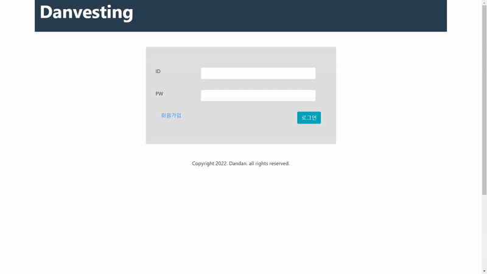
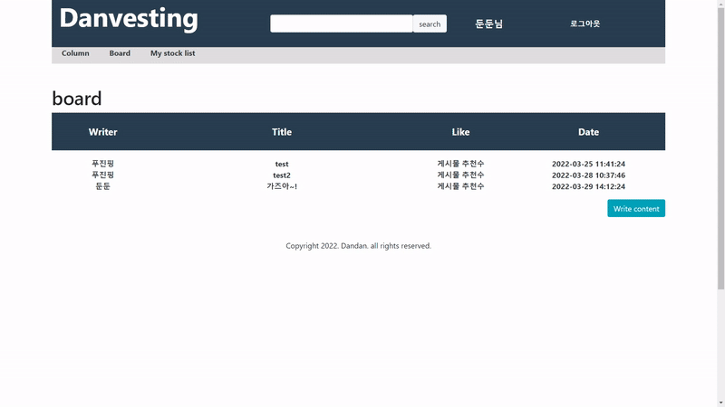
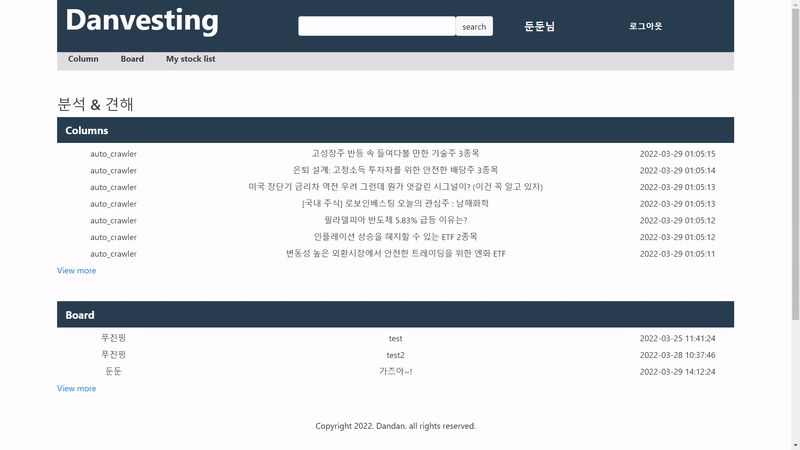
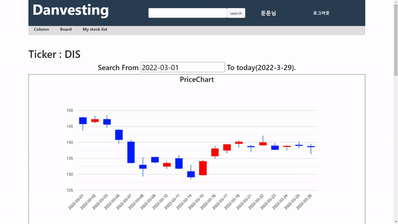

# danvesting
### 포트폴리오PPT
[portfolio](portfolioPPT.pdf)

:loudspeaker: 긴급 공지 :loudspeaker:
현재 원인미상 AWS 서버 이상으로 4월 15일 이후로 접속이 안되는 중입니다.
최소 4월 16일 ~ 최대 4월 17일 사이에 해결하도록 하겠습니다 :kissing_heart:

### 포트폴리오 접속
* 주소 : [danvesting](http://www.dandandevelop.com:8080/main)
* test계정 : ID - asdf@naver.com  PW - 12345

### 프로젝트 설명
* 주식 관련 웹 investing.com을 모티브로 한 웹 프로젝트 개발
* 로그인 기능 & Robinhood API를 사용한 주식가격, 기업정보 조회 & 댓글기능

### 설계
* UI기획
  https://ovenapp.io/project/UmMs7pVmuHIFhAWODSfPs42pEi0o5teg#RsKDE
* DB & URL설계
  https://docs.google.com/spreadsheets/d/1TZ5owEAYrdZrynSVB5nclCb-YuPhLwtDK49aidd3Y_0/edit?usp=sharing
  
### 주요기능
* 회원가입, 로그인, 회원정보 수정
  * packages : [com.dandan.danvesting/user/*](https://github.com/HSNURcat/danvesting/tree/master/src/main/java/com/dandan/danvesting/user)
  * 회원가입View : [/webapp/WEB-INF/jsp/user/signUp.jsp](https://github.com/HSNURcat/danvesting/blob/master/src/main/webapp/WEB-INF/jsp/user/signUp.jsp)
  * 로그인View : [/webapp/WEB-INF/jsp/user/signIn.jsp](https://github.com/HSNURcat/danvesting/blob/master/src/main/webapp/WEB-INF/jsp/user/signIn.jsp)
  * 회원정보 수정 전 사용자확인View : [/webapp/WEB-INF/jsp/user/checkMember.jsp](https://github.com/HSNURcat/danvesting/blob/master/src/main/webapp/WEB-INF/jsp/user/checkMember.jsp)
  * 회원정보 회원정보 수정View : [/webapp/WEB-INF/jsp/user/rewriteUserInfo.jsp](https://github.com/HSNURcat/danvesting/blob/master/src/main/webapp/WEB-INF/jsp/user/rewriteUserInfo.jsp)
  
* 자유게시판 게시물 생성 (이미지 업로드 & 글쓰기)
  * packages : [com.dandan.danvesting/post/*](https://github.com/HSNURcat/danvesting/tree/master/src/main/java/com/dandan/danvesting/post)
  * View : [/webapp/WEB-INF/jsp/post/createPost.jsp](https://github.com/HSNURcat/danvesting/blob/master/src/main/webapp/WEB-INF/jsp/post/createPost.jsp)

* 댓글&좋아요 싫어요
  * packages : [com.dandan.danvesting/post/*](https://github.com/HSNURcat/danvesting/tree/master/src/main/java/com/dandan/danvesting/post)
  * View : [/webapp/WEB-INF/jsp/post/postDetail.jsp](https://github.com/HSNURcat/danvesting/blob/master/src/main/webapp/WEB-INF/jsp/post/postDetail.jsp)

* 칼럼추가
  * packages : [com.dandan.danvesting/column/*](https://github.com/HSNURcat/danvesting/tree/master/src/main/java/com/dandan/danvesting/column)
  * 크롤링 실행 타이머 : [com.dandan.danvesting/common/Crawling.java](https://github.com/HSNURcat/danvesting/blob/master/src/main/java/com/dandan/danvesting/common/Crawling.java)
  
* 종목(주식)정보 with Robinhood API(polygon.io)
  * packages : [com.dandan.danvesting/stock/*](https://github.com/HSNURcat/danvesting/tree/master/src/main/java/com/dandan/danvesting/stock)
  * View : [/webapp/WEB-INF/jsp/stock/stockDetail.jsp](https://github.com/HSNURcat/danvesting/blob/master/src/main/webapp/WEB-INF/jsp/stock/stockDetail.jsp)

### 프로젝트 흐름
* 회원가입  
  
 
* 로그인  
  

* 게시판 게시물 작성  
  

* 좋아요/싫어요 추가 및 댓글작성  
  

* 종목검색  
  

* 종목 리스트 저장  
  

### 외부 라이브러리 라이센스
* Tomcat [Apache Licesne 2.0](https://www.apache.org/licenses/LICENSE-2.0)
* Robinhood [polygon.io](https://polygon.io/eula)
* MySQL [GPLv2 or proprietary](https://www.gnu.org/licenses/old-licenses/gpl-2.0.html)
* Mybatis [Apache Licesne 2.0](https://www.apache.org/licenses/LICENSE-2.0)
* bootstrap [MIT License](https://opensource.org/licenses/MIT)
* jQuery [MIT License](https://opensource.org/licenses/MIT)
* Jsoup [Jsoup License](https://jsoup.org/license)
* Gson [Apache Licesne 2.0](https://www.apache.org/licenses/LICENSE-2.0)

### 향후 구현 계획
* 비대해진 코드들 클래스로 분리시켜서 단순화하기(구조적 리팩토링)
* 사용자 계정 찾기 기능 구현하기(ID, 임시비밀번호 e-mail 발송)
* XBRL파일 형식의 상장기업 재무정보Data 연동, 재무정보 표시 구현하기
